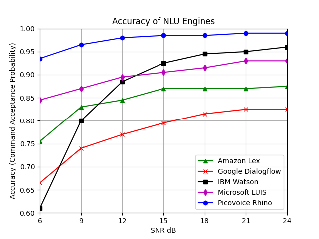

# Speech to Intent Benchmark

[](https://github.com/Picovoice/speech-to-intent-benchmark/blob/master/LICENSE)

This is a framework to benchmark the accuracy of Picovoice's speech-to-intent engine (a.k.a rhino). For more information
regarding the engine refer to its repository directly [here](https://github.com/Picovoice/rhino). This repository contains
all data and code to reproduce the results. In this benchmark we evaluate the accuracy of engine for the context of voice
enabled coffee maker. You can listen to one of the sample commands [here](/data/speech/clean/81774d8e-7da7-4e9b-8cc3-33015b0ae0aa.wav).
In order to simulate the real-life situations we have tested in two noisy conditions (1) Cafe and (2) Kitchen. You can listen
to samples of noisy data [here](/data/misc/noisy1.wav) and [here](/data/misc/noisy2.wav).

# Usage

Clone the directory and its submodules via

```bash
git clone --recurse-submodules https://github.com/Picovoice/speech-to-intent-benchmark.git
```

The repository grabs the latest version of rhino as a Git submodule under [rhino](/rhino). All data needed for this
benchmark including speech, noise, and labels are provided under [data](/data). The benchmark code is located under
[benchmark](/benchmark).

The first step is to mix the clean speech data under [clean](/data/speech/clean) with noise. There are two types of noise
used for this benchmark (1) [cafe](/data/noise/cafe.wav) and (2) [kitchen](/data/noise/kitchen.wav). In order to create
noisy test data enter the following from the root of the repository in shell

```bash
python benchmark/mixer.py ${NOISE}
```

`${NOISE` can be either `kitchen` or `cafe`.

Then in order to run the noisy commands through speech-to-intent engine run the following

```bash
python benchmark/benchmark.py ${NOISE}
``` 

The script creates the accuracy results.

# Results

